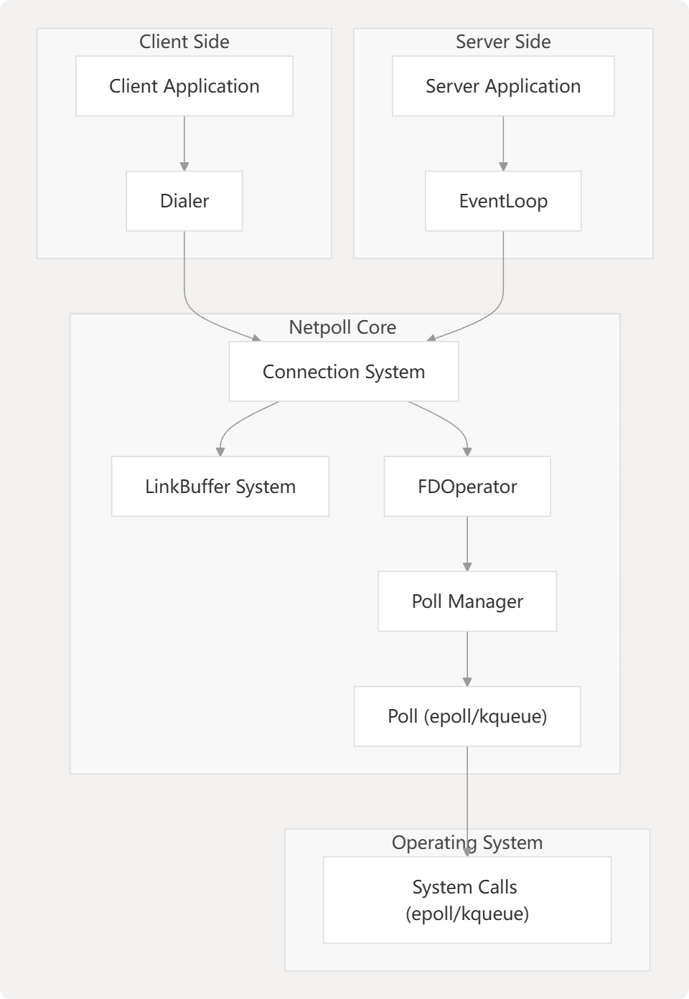
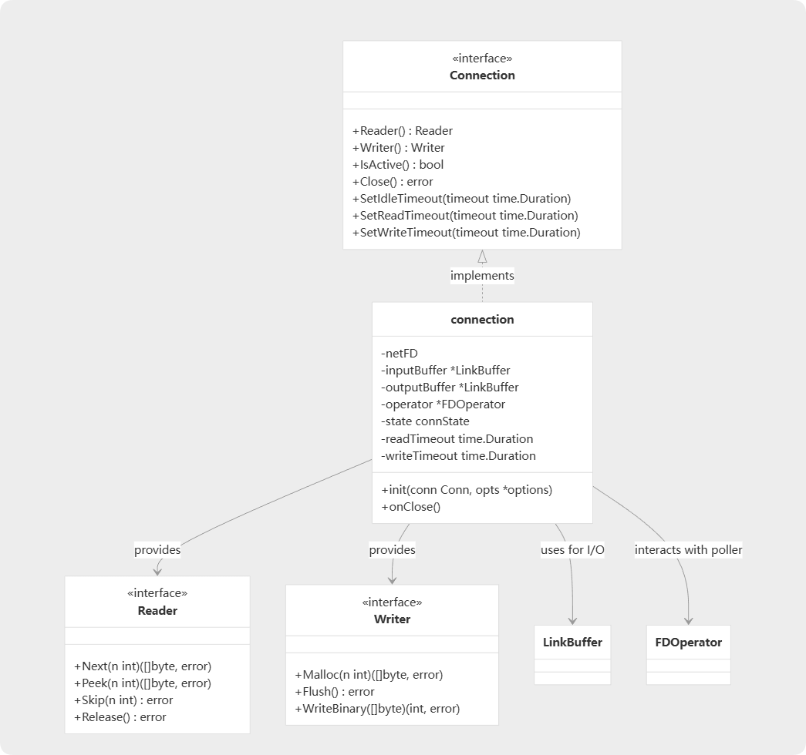

Netpoll 是由 CloudWeGo（字节跳动开源）开发的一个**高性能、非阻塞的 I/O 网络库**，旨在作为 Go 语言标准库 `net` 的替代品，特别是在高并发场景下。

**核心技术：**
Netpoll 的核心思想是借鉴了行业内成熟的 I/O 模型，如 Netty (Java) 和 libevent (C) 的设计，采用了**I/O 多路复用（I/O Multiplexing）**的模式。

*   **Go 标准库 `net` 的模型：** 通常被称为 `goroutine-per-connection` 模型。每当有一个新的网络连接建立时，Go 运行时会创建一个新的 Goroutine 来专门处理这个连接的读写。这种模型简单易用，但在连接数极高（例如几十万甚至上百万）的场景下，会产生以下问题：
    *   **高内存消耗：** 每个 Goroutine 都有自己的栈空间（初始为 2KB），大量连接意味着大量的 Goroutine，从而消耗大量内存。
    *   **调度开销：** Go 调度器需要管理和调度海量的 Goroutine，这会带来额外的 CPU 开销。

*   **Netpoll 的模型：** Netpoll 采用**事件驱动（Event-driven）**和**I/O 多路复用**模型。它通过底层的系统调用（如 Linux 上的 `epoll`，BSD/macOS 上的 `kqueue`）来监控大量连接。
    *   它使用一个或少数几个固定的 Goroutine（称为 Event Loop）来监听所有连接上的 I/O 事件（如数据可读、可写）。
    *   当某个连接上有事件发生时，`epoll_wait` 或 `kqueue` 等系统调用会返回，Event Loop Goroutine 被唤醒。
    *   然后，这个 Goroutine 会处理该事件（例如，读取数据），并将处理任务（如业务逻辑）交给后端的 Goroutine 池来执行。

**一个形象的比喻：**
*   **Go 标准库 `net`**：像是一个餐厅，为每一位进来的顾客都分配一个专属服务员（Goroutine）。顾客少的时候很高效，但如果同时来了一千个顾客，就需要一千个服务员，餐厅会变得拥挤且管理混乱。
*   **Netpoll**：像是一个更现代的餐厅，只有少数几个超级服务员（Event Loop）。他们守在总台，通过一个监控屏幕（epoll/kqueue）查看所有餐桌的需求。哪一桌需要点餐或结账，屏幕上就会亮灯，服务员就立即过去处理，处理完再回来继续看屏幕。这样用很少的人力就能高效服务大量顾客。

---

Netpoll 的主要作用是**解决 Go 标准库 `net` 在超高并发网络服务场景下的性能瓶颈**。具体来说，它的作用体现在以下几个方面：

1.  **大幅降低资源消耗：** 通过使用少量的 Goroutine 管理海量连接，极大地减少了内存占用和 Goroutine 调度开销，使得单个服务实例能够支持更多的并发连接。
2.  **提升性能和吞吐量：**
    *   减少了 Goroutine 间的上下文切换，降低了 CPU 消耗。
    *   提供了**零拷贝（Zero-copy）**的读写能力，在数据传输时可以避免在内核空间和用户空间之间进行不必要的内存拷贝，进一步降低延迟和 CPU 使用率。
3.  **提供更可控的延迟：** 在 `goroutine-per-connection` 模型中，当一个连接的数据准备好后，对应的 Goroutine 还需要等待 Go 调度器的调度才能运行，这可能引入不确定的延迟（Jitter）。Netpoll 的 Event Loop 模型响应更及时，延迟更稳定。
4.  **作为高性能框架的基石：** 为上层应用框架（如 RPC 框架 Kitex 和 HTTP 框架 Hertz）提供一个坚实、高效的网络底座，让框架开发者可以专注于业务逻辑和上层协议的实现。

---

RPC（远程过程调用）场景的特点与 Netpoll 的优势完美契合，这使得 Netpoll 成为构建高性能 RPC 框架的理想选择。

**RPC 场景的核心特点：**

*   **海量长连接（Massive Long-lived Connections）：** 在微服务架构中，服务之间通常会建立长连接池以减少连接建立的开销。一个服务实例可能会同时与成百上千个下游服务实例保持连接。
*   **高吞吐量（High Throughput）：** RPC 调用非常频繁，要求网络层能快速处理大量的请求和响应数据包。
*   **低延迟敏感（Low Latency Sensitive）：** RPC 调用往往处于服务请求的关键路径上，任何额外的网络延迟都会被放大，影响整体系统性能。

**Netpoll 如何满足这些特点：**

1.  **高效处理海量长连接：**
    *   RPC 场景的“海量长连接”正是 Go 标准库 `net` 模型的痛点。Netpoll 的 I/O 多路复用模型天生就是为了解决这个问题而设计的，它可以用极低的资源成本维持数十万甚至上百万的并发连接，这对于大规模微服务部署至关重要。

2.  **为高吞吐量提供保障：**
    *   Netpoll 的**零拷贝**能力对于 RPC 这种数据密集型通信非常有价值。当 RPC 框架对请求/响应进行序列化/反序列化后，数据可以直接在网络缓冲区和应用缓冲区之间传输，减少了 CPU 的拷贝开销，显著提升了吞吐量。
    *   更少的 Goroutine 调度开销也意味着 CPU 可以更多地用于处理业务逻辑，而不是管理连接。

3.  **实现更低、更稳定的延迟：**
    *   Netpoll 的事件驱动模型减少了 Go 运行时调度带来的不确定性，使得网络事件能够被更快地响应，从而降低了端到端的 RPC 调用延迟。对于延迟敏感的在线服务来说，这是一个决定性的优势。

4.  **与连接多路复用（Connection Multiplexing）完美结合：**
    *   现代 RPC 框架（如 gRPC、Kitex）通常会在一条 TCP 连接上实现**多路复用**，即同时发送和接收多个独立的 RPC 请求/响应流。
    *   Netpoll 负责高效地管理底层的 TCP 连接（物理层），而 RPC 框架则在上层处理逻辑流的复用和解复用。Netpoll 提供的稳定、低延迟的 I/O 通道，为上层协议的多路复用提供了坚实的基础。

下图展示了客户端和服务器应用程序如何与 Netpoll 的核心组件交互。Dialer 为客户端创建连接，而 EventLoop 管理服务器的连接。两者都使用 Connection 系统，该系统利用 LinkBuffer 实现高效的内存管理，并利用 FDOperator 与轮询系统（Linux 上的 epoll，macOS 上的 kqueue）进行交互。

连接系统是Netpoll中的核心组件。它管理连接的生命周期和数据传输，实现了Reader和Writer接口来进行数据操作。具体的连接类型具有输入和输出缓冲区（LinkBuffer）、超时控制和连接状态管理。

### 总结

**Netpoll 是一个基于 I/O 多路复用模型的高性能 Go 网络库。它的主要作用是克服 Go 标准库 `net` 在超高并发场景下的资源消耗和性能瓶颈。它之所以非常适合 RPC，是因为 RPC 场景“海量长连接、高吞吐、低延迟”的特点，恰好是 Netpoll 的优势所在。通过使用 Netpoll，像 Kitex 这样的 RPC 框架能够以更少的资源支持更大的并发量，并提供更低、更稳定的服务延迟。**