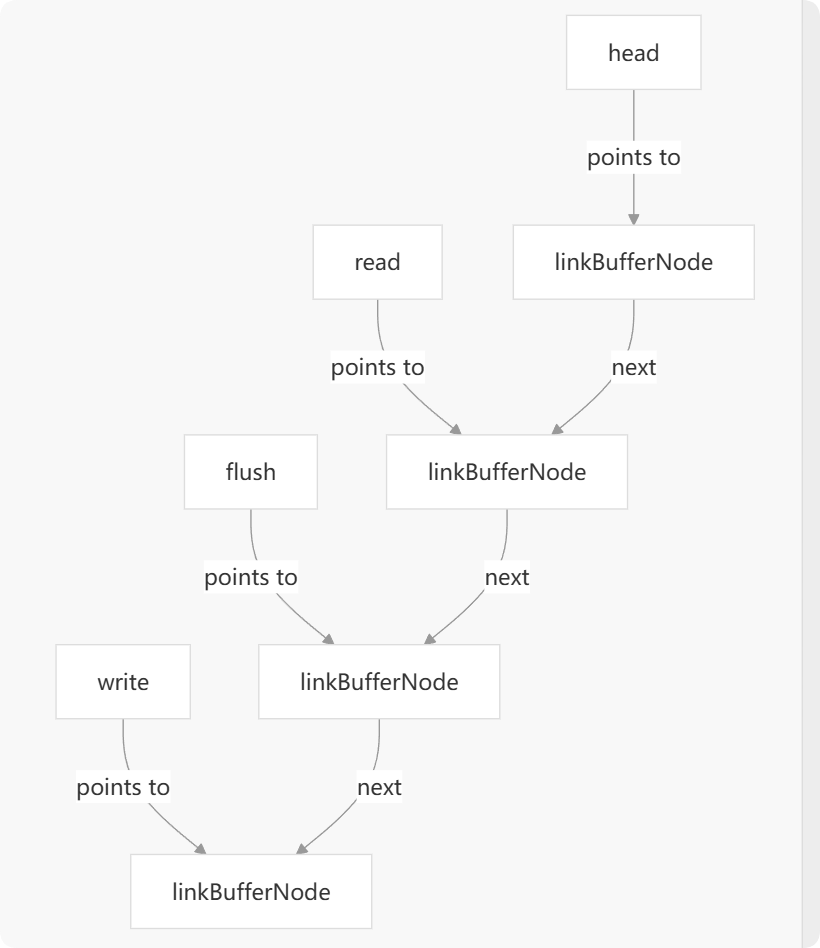

### 1. 核心功能概述

实现了一个名为 `UnsafeLinkBuffer` 的高性能缓冲区。与 Go 标准库的 `bytes.Buffer`（使用单个连续的字节切片）不同，`UnsafeLinkBuffer` 内部使用**内存块的链表**来存储数据。

这种设计的核心目标是**实现网络IO中的零拷贝（Zero-Copy）**，最大限度地减少内存分配和数据复制，从而在高并发、高吞吐量的网络编程场景下提升性能。

它同时实现了 `Reader` 和 `Writer` 接口，可以作为一个功能强大的数据管道。

### 2. 关键设计理念与数据结构




#### 2.1. 链式内存块 (Linked List of Buffers)

- **`linkBufferNode`**: 这是链表的基本节点。每个节点包含一个 `[]byte` 类型的 `buf`，以及读写偏移量、引用计数等元数据。
- **`UnsafeLinkBuffer`**: 这是主结构体，它通过四个核心指针来管理整个链表：
    - `head`: 指向链表的第一个节点，主要用于内存释放。
    - `read`: 指向当前可以**读取**的起始节点和位置。
    - `flush`: 指向已分配（`Malloc`）但尚未提交（`Flush`）为可读数据的边界节点。
    - `write`: 指向当前可以**写入**的节点。

这四个指针将整个缓冲区划分为几个区域：
`[已读数据 | 可读数据 | 已分配未提交数据 | 可用空间]`
`^ head      ^ read      ^ flush           ^ write`

#### 2.2. 零拷贝读写 (Zero-Copy Read/Write)

这是 `LinkBuffer` 的灵魂所在。

- **零拷贝写 (`Malloc` / `Flush` 模式)**:
    1.  调用 `Malloc(n)` 向缓冲区申请一块 `n` 字节的内存。`LinkBuffer` 不会进行任何数据拷贝，而是直接返回其内部 `write` 节点上的一块可用内存切片 `[]byte`。
    2.  调用者（例如，网络库的底层读操作）直接将数据读入这块返回的切片中。
    3.  数据填充完毕后，调用 `Flush()`。这个操作仅仅是移动 `flush` 指针，将这块内存标记为“可读”，并更新总长度。整个过程没有发生从用户缓冲区到 `LinkBuffer` 的内存拷贝。

- **零拷贝读 (`Next` / `Release` 模式)**:
    1.  调用 `Next(n)` 获取 `n` 字节的数据。
    2.  **如果这 `n` 字节恰好位于单个 `linkBufferNode` 内**，`Next` 会直接返回一个指向该节点内部内存的切片，实现了零拷贝。
    3.  **如果这 `n` 字节跨越了多个节点**，零拷贝无法实现。此时 `LinkBuffer` 会分配一块新的内存，将多个节点的数据**拷贝**进去，并返回这个新的切片。为了管理这块新内存的生命周期，它会被暂存到 `UnsafeLinkBuffer` 的 `caches` 字段中。
    4.  数据使用完毕后，必须调用 `Release()`。这个方法会释放掉所有已经被 `Next` 或 `Skip` 消耗掉的 `linkBufferNode`，以及 `caches` 中为跨节点读取而分配的临时内存。**忘记调用 `Release` 会导致内存泄漏**。

#### 2.3. 内存管理与生命周期

- **引用计数 (`refer` & `origin`)**: `Slice(n)` 方法可以创建一个新的、只读的 `LinkBuffer`，它共享原始 `LinkBuffer` 的底层内存，而不是拷贝。这是通过引用计数实现的。`Refer` 方法会增加原始节点的引用计数，确保在所有引用者都 `Release` 之前，底层内存不会被释放。
- **对象池 (`sync.Pool`)**: `linkBufferNode` 结构体本身是通过 `sync.Pool` 进行复用的。当一个节点被 `Release` 且引用计数归零时，它会被放回池中，减少了 Go GC 的压力。
- **自定义内存分配器**: 代码中的 `malloc` 和 `dirtmake` 暗示它可能使用了自定义的内存分配器（例如 `mcache`），这通常是为了在特定场景下比 Go 原生分配器性能更好。
- **阈值策略 (`BinaryInplaceThreshold`)**: 在 `WriteBinary` 方法中，有一个重要的优化。
    - 当写入的数据量**较小**时，会选择**拷贝**数据到当前 `write` 节点。这避免了为少量数据创建新节点的开销。
    - 当写入的数据量**较大**时（超过 `BinaryInplaceThreshold`），它会创建一个新的 `linkBufferNode`，并让这个节点的 `buf` **直接指向**用户传入的 `[]byte`。这是一种真正的零拷贝写入，但要求调用者之后不能再修改这块数据。

### 3. 主要方法分析

#### Reader 接口

- `Len()`: 原子地返回可读数据的总长度。
- `Next(n)`: 获取 `n` 字节数据，可能是零拷贝（单节点）或有拷贝（跨节点）。
- `Peek(n)`: 查看 `n` 字节数据，但不移动 `read` 指针。它有一个内部缓存 `cachePeek` 来优化连续的 `Peek` 操作。
- `Skip(n)`: 跳过 `n` 字节数据，比 `Next` 更高效，因为它不返回数据。
- `ReadBinary(n)`: **总是返回一份数据的拷贝**。这与 `Next` 不同，它更安全，因为返回的 `[]byte` 的生命周期独立于 `LinkBuffer`。
- `Slice(n)`: 创建一个零拷贝的、只读的子 `LinkBuffer` 视图。
- `Release()`: **至关重要**，用于释放已读的内存。

#### Writer 接口

- `Malloc(n)`: 申请 `n` 字节的写入空间（零拷贝）。
- `Flush()`: 提交通过 `Malloc` 写入的数据，使其变为可读。
- `WriteBinary(p)`: 写入一个 `[]byte`，根据大小决定是拷贝还是直接链接（零拷贝）。
- `WriteString(s)`: `WriteBinary` 的字符串版本。
- `WriteDirect(...)`: 一个高级功能，允许在缓冲区的中间直接插入一个外部的 `[]byte`，这也是一种零拷贝技术，常用于拼接网络包头和包体。

### 4. 代码分析

```go
const BinaryInplaceThreshold = block4k
```

- **作用**: 这是一个性能优化的**阈值常量**。

- **详细解释**:
  这个常量用在 WriteBinary 方法中，用于决定如何处理写入的数据。WriteBinary 有两种写入方式：

  1. **拷贝 (Copy)**: 当写入的数据量**较小**时（小于等于 `BinaryInplaceThreshold`），`LinkBuffer` 会将这些数据**拷贝**到当前最后一个内存块（`write` 节点）的可用空间中。
  2. **原地/零拷贝 (In-place/No-copy)**: 当写入的数据量**较大**时（大于 `BinaryInplaceThreshold`），`LinkBuffer` 会放弃拷贝。取而代之，它会创建一个新的 `linkBufferNode`，并让这个节点的内部缓冲区**直接指向**你传入的 []byte。

- **为什么需要这个阈值？**

  - 对于**小数据**，copy() 操作本身非常快，其开销远小于创建和管理一个新的链表节点（`linkBufferNode`）的开销。因此，拷贝更划算。
  - 对于**大数据**（这里是大于4KB），copy() 操作的成本会变得很高（消耗CPU和时间）。此时，创建一个新节点的开销就显得微不足道了，直接链接外部内存（零拷贝）的性能优势就体现出来了。
  - `BinaryInplaceThreshold` 就是这个“小数据”和“大数据”的临界点。

  

```go
var LinkBufferCap = block4k
```

- **作用**: 这是一个**可配置的变量**，用于定义 `LinkBuffer` 内部新分配的内存块（node）的**最小容量**。
- **详细解释**:
  当 `LinkBuffer` 的当前内存块空间不足，需要分配一个新的 `linkBufferNode` 时，这个变量就起作用了。`newLinkBufferNode` 函数会检查请求的内存大小：
  - 如果请求的大小小于 `LinkBufferCap（4KB）`，它仍然会分配一个容量为 `LinkBufferCap` 的内存块。
  - 如果请求的大小大于 `LinkBufferCap`，则按请求的大小分配。
- **为什么要有最小容量？**
  - **减少内存碎片**: 避免链表中出现大量几十字节、几百字节的微小内存块，这会让管理变得低效。
  - **摊销分配成本**: 分配内存是有开销的。一次性分配一个稍大（如4KB）的块，可以服务于后续多次小数据的写入，从而摊薄了单次分配的成本。
  - **提高效率**: 拥有一个较大容量的节点意味着更多的数据可以被连续写入，减少了频繁创建新节点的需要。
  
  

```go
func NewLinkBuffer(size ...int) *LinkBuffer {
	buf := &LinkBuffer{}
	var l int
	if len(size) > 0 {
		l = size[0]
	}
	node := newLinkBufferNode(l)
	buf.head, buf.read, buf.flush, buf.write = node, node, node, node
	return buf
}
```

1. **创建 LinkBuffer 结构体**: 分配 LinkBuffer 对象本身的内存。
2. **解析初始容量**: 从可选参数中获取用户期望的初始容量。
3. **创建初始内存块**: 根据指定的容量，创建一个 linkBufferNode 作为链表的第一个节点。这个节点定义了缓冲区的初始可用空间。
4. **设置初始状态**: 将 head, read, flush, write 四个核心指针都指向这个初始节点，表明缓冲区当前是完全空的，并且已经准备好进行写入操作。


```go
type UnsafeLinkBuffer struct {
	length     int64 // 存储当前缓冲区中可读数据的总长度（以字节为单位）。
	mallocSize int  // 存储已经通过 Malloc(n) 方法预分配但尚未提交的内存大小。

	head  *linkBufferNode // release head
	read  *linkBufferNode // read head
	flush *linkBufferNode // malloc head
	write *linkBufferNode // malloc tail

	// buf allocated by Next when cross-package, which should be freed when release
	caches [][]byte

	// for `Peek` only, avoid creating too many []byte in `caches`
	// fix the issue when we have a large buffer and we call `Peek` multiple times
	cachePeek []byte
}
```

- **head *linkBufferNode**
  - **作用**: 指向整个链表的**物理头节点**。它的主要任务是**内存回收**。
  - **移动时机**: 当调用 Release() 方法时，所有在 read 指针之前的、已经被消耗掉的节点（从 head 到 read 的前一个节点）都会被释放，然后 head 指针会前移到 read 指针的位置。
- **read *linkBufferNode**
  - **作用**: 指向当前**可读数据**的起始节点。所有读取操作（如 Next, Peek, Skip）都从这个节点开始。
  - **移动时机**: 当读取操作消耗完一个节点的数据后，read 指针会移动到下一个节点 (read = read.next)。
- **flush *linkBufferNode**
  - **作用**: 标记**可读数据**和**预分配内存**之间的边界。
  - **移动时机**: 当调用 Flush() 方法时，flush 指针会前移到 write 指针的位置，表示 flush 和 write 之间的那段预分配内存现在已经变为可读数据。
- **write *linkBufferNode**
  - **作用**: 指向当前可以写入或分配新内存的**尾节点**。所有写入操作（如 Malloc, WriteBinary）都在这个节点或其后继节点上进行。
  - **移动时机**: 当 write 节点空间不足时，会创建一个新节点并链接到其后，然后 write 指针会移动到这个新节点上。

- **caches [][]byte**
  - **作用**: 存储因**跨节点 Next(n) 操作**而产生的临时内存拷贝。
  - **设计**:
    - 零拷贝的理想情况是 Next(n) 的数据恰好在单个节点内。
    - 但如果 n 字节的数据横跨了多个节点，LinkBuffer 必须分配一块新的连续内存，将这些分散的数据拷贝进去，然后返回给用户。
    - 为了避免这块临时内存的生命周期失控，它的引用被存放在 caches 这个切片里。
    - 当用户调用 Release() 时，不仅会释放旧的 linkBufferNode，还会遍历 caches 并释放其中的所有临时 []byte，防止内存泄漏。
- **cachePeek []byte**
  - **作用**: 专为 Peek(n) 操作设计的**可复用**的临时缓存。
  - **设计**:
    - Peek 操作是只读不消耗，用户可能会连续多次调用 Peek（例如，先 Peek(2) 看包头，再 Peek(10) 看更多内容）。
    - 如果每次跨节点的 Peek 都像 Next 一样在 caches 中创建一个新缓存，会造成大量不必要的内存分配。
    - cachePeek 就是为了解决这个问题。它是一个单一的 []byte，第一次 Peek 时分配，后续的 Peek 会尝试在这个缓存的基础上进行扩展（append），而不是重新分配。
    - 当任何改变缓冲区读取位置的操作（如 Next, Skip）发生时，这个缓存会被清空，因为它里面的数据可能已经失效。

```go
func (b *UnsafeLinkBuffer) Next(n int) (p []byte, err error) {
	if n <= 0 {
		return
	}
	// check whether enough or not.
	if b.Len() < n {
		return p, fmt.Errorf("link buffer next[%d] not enough", n)
	}
	b.recalLen(-n) // re-cal length

	// single node
	if b.isSingleNode(n) {
		return b.read.Next(n), nil
	}
	// multiple nodes
	var pIdx int
	if block1k < n && n <= mallocMax {
		p = malloc(n, n)
		b.caches = append(b.caches, p)
	} else {
		p = dirtmake.Bytes(n, n)
	}
	var l int
	for ack := n; ack > 0; ack = ack - l {
		l = b.read.Len()
		if l >= ack {
			pIdx += copy(p[pIdx:], b.read.Next(ack))
			break
		} else if l > 0 {
			pIdx += copy(p[pIdx:], b.read.Next(l))
		}
		b.read = b.read.next
	}
	_ = pIdx
	return p, nil
}
```

```go
b.recalLen(-n) // re-cal length
```

- **并发安全**: 在单生产者-单消费者（SPSC）模型中，这可以立即让其他可能在检查 Len() 的协程知道这部分数据已经被“预定”了，避免了竞态条件。
- **状态一致性**: 无论后续的读取是单节点还是多节点，缓冲区的逻辑长度已经正确更新。

####  路径一：单节点快速路径 (The Fast Path / Zero-Copy)

如果 isSingleNode(n) 返回 true：

- **执行**: return b.read.Next(n), nil
- **发生了什么**:
  1. b.read.Next(n) 是在 linkBufferNode 上的方法。它不做任何内存分配或数据拷贝。
  2. 它仅仅是执行了一个**切片操作**：p = b.read.buf[b.read.off : b.read.off+n]。
  3. 然后更新节点内的偏移量：b.read.off += n。
- **结果**: 返回的 p 是一个指向 LinkBuffer **内部原始内存**的视图（view）。这是**真正的零拷贝**，性能极高，因为唯一的开销就是几次整数运算和指针移动。

#### 路径二：多节点慢速路径 (The Slow Path / Copying)

如果 isSingleNode(n) 返回 false，意味着 n 字节的数据分散在多个节点上。此时无法实现零拷贝，必须将它们拷贝到一个新的、连续的内存块中。

- **步骤 A: 分配新内存**
  - 必须分配一块大小为 n 的新内存 p 来容纳所有分散的数据。
  - 这里有一个分配策略的优化：对于不大不小（1KB < n <= mallocMax）的块，使用一个特定的分配器 malloc，并**将其指针存入 b.caches**。对于其他大小的块，使用 dirtmake.Bytes。
  - **b.caches 的作用至关重要**: Next 函数创建的这块内存 p 的生命周期必须被 LinkBuffer 管理。将其存入 caches 意味着，当用户调用 b.Release() 时，这块内存会被正确释放，从而**防止内存泄漏**。
- **步骤 B: 循环拷贝**
  - for ack := n; ...: 这个循环会持续进行，直到 ack（剩余需要拷贝的字节数）减为 0。
  - l = b.read.Len(): 获取当前 read 节点的剩余可读数据长度。
  - **if l >= ack**: 这是循环的最后一次迭代。当前节点的数据足够满足剩余的需求。
    - b.read.Next(ack): 从当前节点取出 ack 字节（更新节点内部偏移量）。
    - copy(...): 将这 ack 字节拷贝到目标 p 中。
    - break: 拷贝完成，退出循环。
  - **else if l > 0**: 这是处理中间节点的情况。当前节点的数据不足以满足全部需求。
    - b.read.Next(l): 取出当前节点的**所有**剩余数据。
    - copy(...): 将这些数据拷贝到目标 p 中。
  - **b.read = b.read.next**: 在一个节点的数据被完全拷贝后，将 read 指针**移动到下一个节点**，为下一次循环做准备。